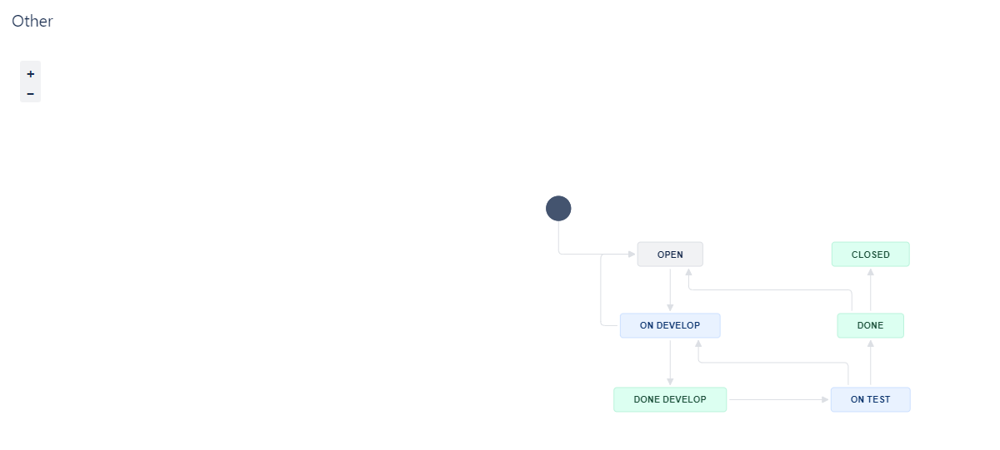
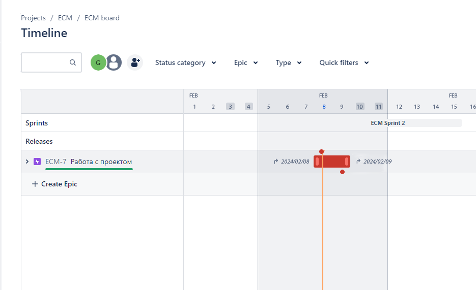

# Домашнее задание к занятию «Жизненный цикл ПО» - `Горбачев Олег`

## Задание

### Подготовка к выполнению

1. Получить бесплатную версию Jira - https://www.atlassian.com/ru/software/jira/work-management/free (скопируйте ссылку в адресную строку). Вы можете воспользоваться любым(в том числе бесплатным vpn сервисом) если сайт у вас недоступен. Кроме того вы можете скачать [docker образ](https://hub.docker.com/r/atlassian/jira-software/#) и запустить на своем хосте self-managed версию jira.
2. Настроить её для своей команды разработки.
3. Создать доски Kanban и Scrum.
4. [Дополнительные инструкции от разработчика Jira](https://support.atlassian.com/jira-cloud-administration/docs/import-and-export-issue-workflows/).

### Основная часть

Необходимо создать собственные workflow для двух типов задач: bug и остальные типы задач. Задачи типа bug должны проходить жизненный цикл:

1. Open -> On reproduce.
2. On reproduce -> Open, Done reproduce.
3. Done reproduce -> On fix.
4. On fix -> On reproduce, Done fix.
5. Done fix -> On test.
6. On test -> On fix, Done.
7. Done -> Closed, Open.

Остальные задачи должны проходить по упрощённому workflow:

1. Open -> On develop.
2. On develop -> Open, Done develop.
3. Done develop -> On test.
4. On test -> On develop, Done.
5. Done -> Closed, Open.

## Решение

### Подготовка к выполнению
1. Используя VPN получил бесплатную версию Jira, создал аккаунт.
2. Создал доски Kanban и Scrum:

### Решение основной части

Создал статусы для доски Kanban:

Создаю два Workflows согласно заданию:

Workflow для типов задач Bug:

Workflow для всех остальных типов задач:

Создаю задачу с типом Bug:

Довел задачу до состояния Done:

Создал задачу с типом Epic и две задачи с типом Task, привязанные к Epic:

Довел задачи до состояния Done:

Вернул задачи обратно в состояние Open:

Перехожу в Scrum проект, создаю задачи с эпиком и планирую спринт:

Довожу задачи до состояния выполнения и закрываю спринт:

Судя по Timeline выполнение спринта произошло в рамках запланированного времени:

## Выгруженные схемы Workflow:

* [bug workflow](https://github.com/DemoniumBlack/fedorchukds-devops-33-22/blob/main/Workflows/Bug.xml)
* [other workflow](https://github.com/DemoniumBlack/fedorchukds-devops-33-22/blob/main/Workflows/Other.xml)
